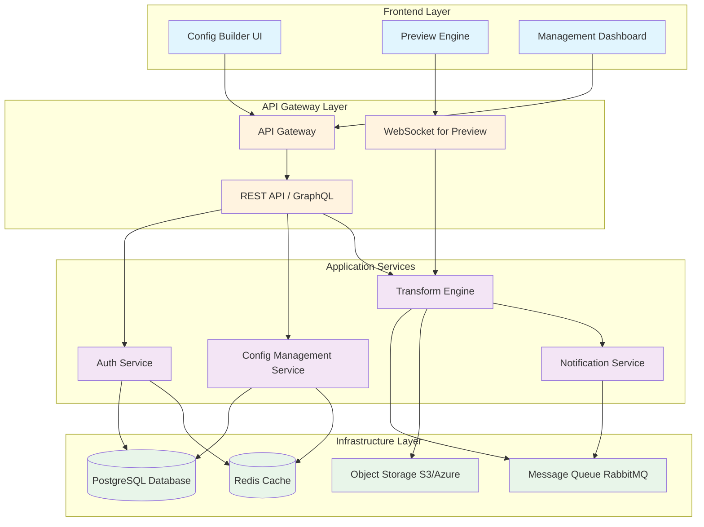
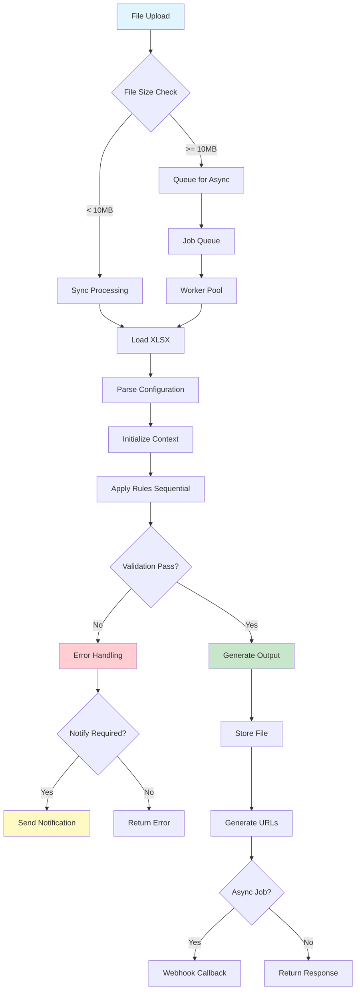

## . Executive Summary

A multi-tenant SaaS platform for configurable document transformations, starting with XLSX to CSV conversions. Users can visually design transformation rules, save them as reusable configurations, and execute them via API or UI.

## 2. System Architecture

### 2.1 High-Level Architecture



### 2.2 Core Components

### Configuration Builder Service

- Visual rule builder with XLSX preview
- Drag-and-drop interface for transformation steps
- Real-time or on-demand preview capability
- Configuration testing sandbox

### Transformation Engine

- Modular rule processors
- Support for complex multi-sheet operations
- Formula evaluation engine
- Validation framework

### API Service

- RESTful endpoints for transformation requests
- Batch processing support
- Webhook callbacks for async operations
- SDK support layer

### Storage Service

- Temporary file storage with TTL
- Configuration persistence
- Audit logging
- Optional long-term storage (paid tier)

## 3. Data Models

### 3.1 Configuration Schema

```json
{
	"configId": "uuid",
	"organizationId": "uuid",
	"name": "Monthly Sales Report Transform",
	"version": 1,
	"createdBy": "userId",
	"createdAt": "timestamp",
	"rules": [
		{
			"id": "rule-1",
			"type": "SELECT_WORKSHEET",
			"params": {
				"value": "Line",
				"type": "name"
			}
		},
		{
			"id": "rule-2",
			"type": "VALIDATE_COLUMNS",
			"params": {
				"numOfColumns": 15,
				"onFailure": {
					"action": "NOTIFY",
					"notificationChannel": "email",
					"recipients": ["admin@company.com"]
				}
			}
		},
		{
			"id": "rule-3",
			"type": "UNMERGE_AND_FILL",
			"params": {
				"column": "A",
				"fillDirection": "down"
			}
		},
		{
			"id": "rule-4",
			"type": "DELETE_ROWS",
			"params": {
				"condition": {
					"type": "CONTAINS",
					"column": "any",
					"value": "Subtotal"
				}
			}
		},
		{
			"id": "rule-5",
			"type": "COMBINE_WORKSHEETS",
			"params": {
				"source": {
					"worksheetPattern": "IVS *",
					"preprocessing": ["rule-3", "rule-4"]
				},
				"target": {
					"worksheet": "70000014",
					"preprocessing": ["rule-4"]
				},
				"operation": "APPEND",
				"direction": "vertical"
			}
		}
	],
	"outputFormat": {
		"type": "CSV",
		"delimiter": ",",
		"encoding": "UTF-8",
		"includeHeaders": true
	}
}
```

### 3.2 Transformation DSL (Domain Specific Language)

```tsx
// Alternative DSL representation for power users
interface TransformationDSL {
	SELECT: 'Line' | { pattern: string } | { index: number };
	VALIDATE: {
		columns: { count: number; onError: Action };
	};
	TRANSFORM: Operation[];
	COMBINE?: {
		sheets: string[];
		method: 'append' | 'merge' | 'join';
	};
	OUTPUT: OutputSpec;
}

type Operation =
	| { UNMERGE: Column[] }
	| { FILL: { columns: Column[]; direction: 'down' | 'up' } }
	| { DELETE: { rows: RowSelector } }
	| { DELETE_COLUMNS: Column[] }
	| { EVALUATE_FORMULAS: boolean }
	| { FILTER: Condition };
```

### 3.3 Database Schema

```sql
-- Organizations
CREATE TABLE organizations (
    id UUID PRIMARY KEY DEFAULT gen_random_uuid(),
    name VARCHAR(255) NOT NULL,
    plan VARCHAR(50) DEFAULT 'free',
    created_at TIMESTAMP DEFAULT NOW(),
    updated_at TIMESTAMP DEFAULT NOW()
);

-- Users
CREATE TABLE users (
    id UUID PRIMARY KEY DEFAULT gen_random_uuid(),
    organization_id UUID REFERENCES organizations(id),
    email VARCHAR(255) UNIQUE NOT NULL,
    role VARCHAR(50) DEFAULT 'member',
    created_at TIMESTAMP DEFAULT NOW()
);

-- Configurations
CREATE TABLE configurations (
    id UUID PRIMARY KEY DEFAULT gen_random_uuid(),
    organization_id UUID REFERENCES organizations(id),
    name VARCHAR(255) NOT NULL,
    description TEXT,
    rules JSONB NOT NULL,
    version INTEGER DEFAULT 1,
    is_active BOOLEAN DEFAULT true,
    created_by UUID REFERENCES users(id),
    created_at TIMESTAMP DEFAULT NOW(),
    updated_at TIMESTAMP DEFAULT NOW()
);

-- Configuration Versions (for history)
CREATE TABLE configuration_versions (
    id UUID PRIMARY KEY DEFAULT gen_random_uuid(),
    configuration_id UUID REFERENCES configurations(id),
    version INTEGER NOT NULL,
    rules JSONB NOT NULL,
    created_by UUID REFERENCES users(id),
    created_at TIMESTAMP DEFAULT NOW(),
    UNIQUE(configuration_id, version)
);

-- Transformation Jobs
CREATE TABLE transformation_jobs (
    id UUID PRIMARY KEY DEFAULT gen_random_uuid(),
    organization_id UUID REFERENCES organizations(id),
    configuration_id UUID REFERENCES configurations(id),
    status VARCHAR(50) DEFAULT 'pending',
    input_file_url TEXT,
    output_file_url TEXT,
    error_message TEXT,
    started_at TIMESTAMP,
    completed_at TIMESTAMP,
    created_by UUID REFERENCES users(id),
    created_at TIMESTAMP DEFAULT NOW()
);

-- API Keys
CREATE TABLE api_keys (
    id UUID PRIMARY KEY DEFAULT gen_random_uuid(),
    organization_id UUID REFERENCES organizations(id),
    key_hash VARCHAR(255) NOT NULL,
    name VARCHAR(255),
    permissions JSONB,
    last_used_at TIMESTAMP,
    created_by UUID REFERENCES users(id),
    created_at TIMESTAMP DEFAULT NOW(),
    expires_at TIMESTAMP
);

```

## 4. API Specification

### 4.1 Core Endpoints

### Configuration Management

```yaml
# Create Configuration
POST /v1/configurations
Headers:
  Authorization: Bearer {token}
  Content-Type: application/json
Body:
  {
    "name": "Monthly Report Transform",
    "description": "Transforms monthly sales reports",
    "rules": [...]
  }
Response: 201 Created
  {
    "id": "config-uuid",
    "name": "Monthly Report Transform",
    "version": 1,
    "createdAt": "2024-01-01T00:00:00Z"
  }

# List Configurations
GET /v1/configurations
Query Parameters:
  - page: integer (default: 1)
  - limit: integer (default: 20)
  - search: string
Response: 200 OK
  {
    "data": [...],
    "pagination": {
      "page": 1,
      "limit": 20,
      "total": 45
    }
  }

# Get Configuration
GET /v1/configurations/{configId}
Response: 200 OK

# Update Configuration
PUT /v1/configurations/{configId}
Body: { "rules": [...] }
Response: 200 OK

# Delete Configuration
DELETE /v1/configurations/{configId}
Response: 204 No Content

# Test Configuration
POST /v1/configurations/{configId}/test
Body:
  {
    "sampleFile": "multipart/form-data"
  }
Response: 200 OK
  {
    "preview": {
      "original": [...],
      "transformed": [...]
    }
  }

```

### Transformation Execution

```yaml
# Single Transformation
POST /v1/transform
Headers:
  X-API-Key: {apiKey}
Body (multipart/form-data):
  - configId: string
  - file: binary
  - options: {
      "async": boolean,
      "callback": "https://webhook.url",
      "retention": "1h"
    }
Response (sync): 200 OK
  {
    "jobId": "job-uuid",
    "status": "completed",
    "downloadUrl": "https://...",
    "expiresAt": "2024-01-01T01:00:00Z"
  }
Response (async): 202 Accepted
  {
    "jobId": "job-uuid",
    "status": "processing",
    "statusUrl": "/v1/jobs/job-uuid"
  }

# Batch Transformation
POST /v1/transform/batch
Body:
  {
    "configId": "config-uuid",
    "files": ["url1", "url2"],
    "options": {...}
  }
Response: 202 Accepted
  {
    "batchId": "batch-uuid",
    "jobs": [
      {"jobId": "job-1", "status": "queued"},
      {"jobId": "job-2", "status": "queued"}
    ]
  }

# Get Job Status
GET /v1/jobs/{jobId}
Response: 200 OK
  {
    "jobId": "job-uuid",
    "status": "completed|processing|failed",
    "progress": 75,
    "downloadUrl": "https://...",
    "error": null
  }

```

### 4.2 Authentication Strategy

```tsx
interface AuthStrategy {
  // API Key Authentication
  apiKey: {
    header: 'X-API-Key',
    format: 'org_{organizationId}_{randomString}',
    storage: 'hashed in database',
    validation: async (key: string) => {
      const hash = await bcrypt.hash(key);
      return db.apiKeys.findOne({ keyHash: hash });
    }
  },

  // JWT Authentication (for UI)
  jwt: {
    algorithm: 'RS256',
    issuer: 'auth.transform-platform.com',
    audience: 'api.transform-platform.com',
    expiry: '1h',
    refreshExpiry: '30d',
    claims: {
      sub: 'userId',
      org: 'organizationId',
      role: 'admin|member|viewer',
      permissions: []
    }
  },

  // OAuth2 Support
  oauth2: {
    providers: ['google', 'microsoft', 'github'],
    flow: 'authorization_code',
    scopes: {
      'transform:read': 'View transformations',
      'transform:write': 'Create transformations',
      'config:admin': 'Manage configurations'
    }
  }
}

```

## 5. Processing Pipeline

### 5.1 Transformation Flow



## 6. Security & Compliance

### 6.1 Security Measures

### Data Protection

- **Encryption at Rest**: AES-256 for all stored files and configurations
- **Encryption in Transit**: TLS 1.3 minimum for all API communications
- **File Scanning**: Automated malware scanning on upload
- **Input Validation**: Strict validation of all inputs to prevent injection attacks
- **Formula Sandboxing**: Isolated execution environment for formula evaluation

### Access Control

```tsx
interface RBACModel {
	roles: {
		admin: [
			'config:create',
			'config:read',
			'config:update',
			'config:delete',
			'transform:execute',
			'org:manage',
			'users:manage',
		];
		member: [
			'config:create',
			'config:read',
			'config:update',
			'transform:execute',
		];
		viewer: ['config:read', 'transform:execute'];
	};

	resourcePermissions: {
		configuration: {
			owner: ['read', 'update', 'delete', 'share'];
			shared: ['read', 'execute'];
			organization: ['read'];
		};
	};
}
```

### Audit Trail

```sql
CREATE TABLE audit_logs (
    id UUID PRIMARY KEY DEFAULT gen_random_uuid(),
    organization_id UUID REFERENCES organizations(id),
    user_id UUID REFERENCES users(id),
    action VARCHAR(100) NOT NULL,
    resource_type VARCHAR(50),
    resource_id UUID,
    ip_address INET,
    user_agent TEXT,
    request_body JSONB,
    response_status INTEGER,
    created_at TIMESTAMP DEFAULT NOW()
);

-- Index for efficient querying
CREATE INDEX idx_audit_logs_org_time
ON audit_logs(organization_id, created_at DESC);

```

### 6.2 Compliance Requirements

### GDPR Compliance

- Right to erasure (delete all user data)
- Data portability (export configurations)
- Privacy by design (minimal data collection)
- Consent management
- Data processing agreements

### HIPAA Compliance (Future)

- Business Associate Agreements (BAA)
- PHI encryption and access controls
- Audit logging for PHI access
- Employee training requirements

### SOC 2 Type II Controls

- Access controls and authentication
- Data encryption and protection
- System monitoring and alerting
- Incident response procedures
- Change management processes

## 7. Monitoring & Observability

### 7.1 Metrics to Track

```yaml
Application Metrics:
  - Transformation success rate
  - Average processing time by file size
  - Rule execution performance
  - API endpoint latency (p50, p95, p99)
  - Queue depth and worker utilization

Business Metrics:
  - Daily/Monthly active users
  - Configurations created per organization
  - Transformation volume by plan tier
  - Storage usage per organization
  - API usage by endpoint

Infrastructure Metrics:
  - CPU and memory utilization
  - Database connection pool status
  - S3 storage usage and costs
  - Redis cache hit rate
  - Message queue throughput
```

### 7.2 Logging Strategy

```tsx
interface LoggingStrategy {
	levels: ['error', 'warn', 'info', 'debug', 'trace'];

	structured: {
		format: 'JSON';
		fields: {
			timestamp: 'ISO 8601';
			level: 'string';
			service: 'string';
			traceId: 'uuid';
			userId: 'uuid';
			organizationId: 'uuid';
			message: 'string';
			metadata: 'object';
		};
	};

	retention: {
		error: '90 days';
		warn: '30 days';
		info: '14 days';
		debug: '7 days';
		trace: '24 hours';
	};

	destinations: {
		production: 'CloudWatch/Azure Monitor';
		development: 'stdout + local file';
	};
}
```

## 8. Implementation Phases

### Phase 1: MVP (Months 1-3)

- Basic XLSX to CSV conversion
- Core transformation rules (select, delete, unmerge, fill)
- Simple web UI for configuration
- Synchronous API processing
- Basic authentication (API keys)
- Single tenant deployment

### Phase 2: Enhanced Features (Months 4-6)

- Advanced rules (combine worksheets, validate)
- Visual configuration builder with preview
- Asynchronous processing for large files
- Multi-tenancy support
- JWT authentication for UI
- Webhook callbacks
- Basic monitoring and logging

### Phase 3: Enterprise Ready (Months 7-9)

- Configuration versioning and history
- Team collaboration features
- Advanced security (OAuth, SSO)
- Compliance certifications (SOC 2)
- SDKs for popular languages
- Performance optimization
- Comprehensive monitoring

### Phase 4: Scale & Expand (Months 10-12)

- Additional file format support
- AI-powered rule suggestions
- Marketplace for configurations
- Advanced scheduling and automation
- Enterprise support features
- Global deployment (multi-region)
